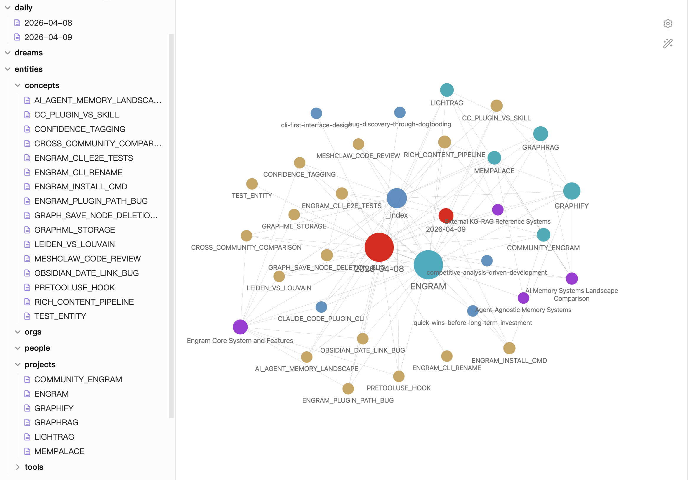

<div align="center">

# 🧠 Engram

**Persistent memory for Claude Code — your coding sessions become a knowledge graph**

[](https://opensource.org/licenses/MIT)
[](https://www.python.org/downloads/)
[](https://docs.anthropic.com/en/docs/claude-code)
[-green.svg)](#installation)

*Like sleep consolidates human memory, `/engram` consolidates your coding sessions into reusable knowledge.*

</div>

---

## ✨ What It Does

You work in Claude Code as usual. When you're done, run `/engram`. That's it.

```
You: /engram

CC: Analyzing session... Found 5 entities, 3 relations.
    ✅ Saved to vault: STDERR_PIPE_BLOCKING, CLAUDE_SLACK_BRIDGE, ...
    📝 Daily note: 2026-04-06.md
```

Behind the scenes:

```
CC Session → /engram → Entity Extraction → Knowledge Graph → Obsidian Vault
                        (CC as LLM)        (NetworkX)       (Markdown + [[wikilinks]])
```

Your knowledge accumulates across sessions. Query it anytime:

```
You: /engram-query how did I fix the stderr bug?

CC: Found STDERR_PIPE_BLOCKING → Bug where claude process stderr fills 64KB
    pipe buffer, blocking stdout. Fixed by adding _drain_stderr async task.
    Related: [[CLAUDE_SLACK_BRIDGE]]
```

## 🏗️ Architecture

Built on the **OODA loop** — the same decision framework used by fighter pilots:

| Phase | What | How |
|:------|:-----|:----|
| **🔍 Observe** | Capture session conversations | CC session JSONL parser |
| **🧭 Orient** | Extract entities & relations | CC does entity extraction — no external API |
| **🎯 Decide** | Consolidate memory | 5-stage: replay → integrate → prune → community → abstract |
| **⚡ Act** | Persist to vault | Obsidian markdown + NetworkX GraphML |

### Zero External Dependencies

- **No API keys** — CC itself is the LLM
- **No vector database** — graph-only retrieval with CC entity routing
- **No Docker** — just Python + networkx
- **No cloud services** — everything runs locally

## 📦 Installation

### Prerequisites

- [Claude Code](https://docs.anthropic.com/en/docs/claude-code) installed
- Python 3.10+ with `networkx`: `pip install networkx`

### Setup

```bash
# 1. Clone and install
git clone https://github.com/qianheng-aws/engram.git
cd engram
pip install -e .

# 2. Initialize vault
engram init ~/.engram/vault

# 3. Register as CC plugin
claude plugin marketplace add .
claude plugin install engram

# 4. (Optional) Enable auto-capture on session end
engram auto on
```

## 🎮 Commands

| Command | Description |
|:--------|:------------|
| `/engram` | Extract entities and relations from current session |
| `/engram-full` | Full consolidation: replay → integrate → prune → community → abstract |
| `/engram-community` | Detect and summarize knowledge clusters (Louvain) |
| `/engram-status` | Show vault statistics and pending sessions |
| `/engram-query <question>` | Search knowledge graph (keyword + graph traversal) |
| `/engram-on` | Enable auto-capture on session end |
| `/engram-off` | Disable auto-capture |

### `/engram` vs `/engram-full`

| | `/engram` | `/engram-full` |
|:--|:---------|:--------------|
| Stages | Replay only | All 4 stages |
| Speed | Fast (one extraction) | Slower (multi-step) |
| When | Every session | Daily/weekly cleanup |

## 🌙 Consolidation Stages

```
┌──────────┐    ┌───────────┐    ┌─────────┐    ┌───────────┐    ┌──────────┐
│  Replay  │ →  │ Integrate │ →  │  Prune  │ →  │ Community │ →  │ Abstract │
│          │    │           │    │         │    │           │    │          │
│ Extract  │    │  Merge    │    │ Decay   │    │  Cluster  │    │ Discover │
│ entities │    │  dupes    │    │ old     │    │  & label  │    │ patterns │
└──────────┘    └───────────┘    └─────────┘    └───────────┘    └──────────┘
```

- **Replay** — CC extracts entities/relations from session → writes to graph + daily note
- **Integrate** — Detects duplicate entities (token similarity) → CC decides merge
- **Prune** — Scores entities by decay (30-day half-life) → archives stale ones
- **Community** — Louvain clustering on the graph → CC titles and summarizes each cluster
- **Abstract** — Analyzes daily notes → discovers behavioral patterns (e.g., "user always debugs by observe → hypothesize → verify")

## 🗂️ Vault Structure

Open the vault in [Obsidian](https://obsidian.md) to get an interactive knowledge graph:

1. Install Obsidian from [obsidian.md](https://obsidian.md)
2. Open Obsidian → **Open folder as vault** → select `~/.engram/vault/`
3. Toggle **Graph View** (Ctrl/Cmd + G) to see your knowledge graph

<div align="center">


*Entity nodes colored by type, with tags, wikilinks, and Graph View visualization*
</div>

```
~/.engram/vault/
├── 📁 entities/              # Knowledge graph nodes
│   ├── people/               #   PERSON entities
│   ├── concepts/             #   Bugs, patterns, designs
│   ├── projects/             #   Repos, packages
│   ├── tools/                #   Libraries, frameworks
│   └── orgs/                 #   Teams, companies
├── 📁 relations/             # Edge table with weights
├── 📁 daily/                 # Session summaries by date
├── 📁 patterns/              # Discovered behavioral patterns
└── 📁 _meta/                 # System data (GraphML, queue, lock)
```

### Entity Example

```markdown
---
entity_type: CONCEPT
tags:
  - entity/concept
aliases:
  - "Stderr Pipe Blocking"
created: 2026-04-03
last_updated: 2026-04-03
degree: 1
cssclasses:
  - entity
  - concept
---

# STDERR_PIPE_BLOCKING

Bug in claude-slack-bridge where claude process writes verbose logs
to stderr but daemon never reads it, causing 64KB buffer to fill
and block the entire process. Fixed by adding _drain_stderr task.

## Relations

- [[CLAUDE_SLACK_BRIDGE]] `PROJECT` — Bridge had this bug causing sessions to hang (weight: 0.8)
```

Every entity links to related entities via `[[wikilinks]]` — Obsidian renders these as an interactive graph. Tags, aliases, and cssclasses enable Dataview queries and Graph View styling.

## 🔧 Design Decisions

| Decision | Why |
|:---------|:----|
| **CC as LLM** | No API keys needed. CC extracts entities directly. |
| **Graph-only retrieval** | No embeddings. CC picks relevant entities from the full list. Scales to ~2000 entities. |
| **nano-graphrag reference** | Reused prompt templates and storage format, not runtime. |
| **Obsidian-native** | All output is valid Obsidian markdown. Open vault → instant graph view. |
| **Description cap** | Keep first + latest description only. Prevents infinite growth. |
| **File lock** | `fcntl.LOCK_EX` + read-merge-write prevents concurrent corruption. |

## 🛠️ CLI Reference

```bash
engram init [PATH]                              # Initialize vault (default: ~/.engram/vault)
engram auto [on|off|status]                     # Toggle auto-capture on session end
engram replay --vault PATH --stdin              # Process extracted JSON (with 15-min dedup)
engram integrate --vault PATH [--stdin]         # Detect or execute merges
engram prune --vault PATH [--stdin]             # Score or execute archival
engram community --vault PATH [--stdin]         # Detect or save community summaries
engram abstract --vault PATH                    # Gather data for pattern discovery
engram save-pattern --vault PATH --stdin        # Save discovered patterns
engram status --vault PATH                      # Vault statistics + hub entities + density
engram query --vault PATH --question "..."      # Search graph
engram context --vault PATH                     # Compact summary for system prompt injection
```

## 📄 License

[MIT](LICENSE) — do whatever you want with it.

---

<div align="center">

*Built in one afternoon with Claude Code. The tool that remembers itself.* 🐾

</div>
